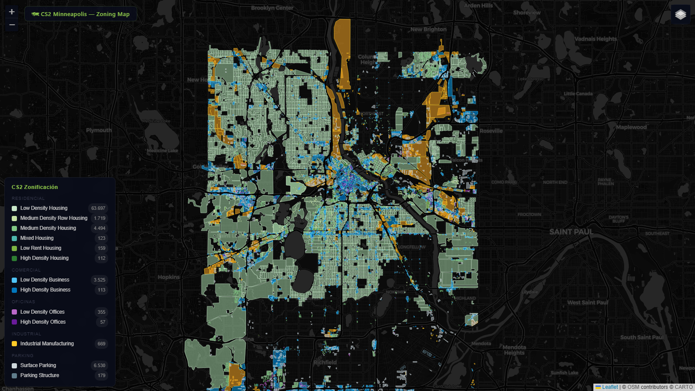

# CS2 Minneapolis OSM Toolkit — v3.1

> Datos GIS reales de OpenStreetMap → Cities: Skylines 2
> Toolkit modular · 100% open source · Sin API keys · Mapa interactivo dark


> 🇬🇧 English version: [README.md](README.md)

## Preview



## ¿Qué hace este toolkit?

Un toolkit modular que extrae datos reales de infraestructura desde OpenStreetMap (vía Overpass API) y los renderea en un mapa Leaflet dark-mode interactivo. Sirve como referencia visual para construir Mineapolis 1:1 en Cities: Skylines 2.

Actualmente incluye **tres módulos**, cada uno con su propio extractor y capa de visualización:

### 🗺 Módulo Zonificación
Clasifica todos los polígonos de edificios en los **11 tipos de zona oficiales de Cities: Skylines 2** (Low/Medium/High Density Residential, Row Housing, Mixed Housing, Low Rent Housing, Low/High Density Business, Low/High Density Offices, Industrial Manufacturing). 81,732 polígonos en el bbox de Mineapolis.

Ejecutar: `cd src && uv run extract-zoning`
Salida: `visualizer/datos_zonificacion.js` (~28 MB)

### 🛣 Módulo Red Vial
Clasifica todas las vías OSM en las **6 categorías de carretera de CS2** (Highway, Major Road, Minor Road, Local Street, Pedestrian Path, Bike Lane). Se renderea como capa de LineStrings encima del mapa de zonificación. 108.825 features.

Ejecutar: `cd src && uv run extract-vial`
Salida: `visualizer/datos_vial.js` (~25 MB)

### 🏥 Módulo Servicios (Sesión 3)

5 capas alineadas a las solapas de servicios base de Cities: Skylines 2 con buena cobertura OpenStreetMap:

- **H** Atención sanitaria y funeraria — hospitales, clínicas, doctors, funeral directors, crematorios, cementerios
- **E** Educación e investigación — schools, universities, colleges, kindergartens, research institutes
- **B** Bomberos — fire stations
- **A** Policía y administración — police HQ, city hall, courthouses, prison + landmarks culturales (bibliotecas, museos, teatros, arts centres, cinemas) + oficinas de gobierno
- **P** Parques — parks, nature reserves, gardens, playgrounds, sports centres

**Generar prebuilt:**
```bash
cd src
uv run extract-services
```

**Descargar prebuilt (~1.3 MB):**
[`datos_servicios.js` v3.1](https://github.com/Osyanne/cs2-minneapolis-osm-toolkit/releases/download/v3.1/datos_servicios.js)

**Render:**
- Polígonos siempre visibles (Hennepin Healthcare, U of M campus, Minnehaha Park, Walker Art Center)
- Markers de char en círculo (H/E/B/A/P) para POIs sin polígono — ocultos en zoom < 12, visibles en zoom ≥ 12
- Click en polígono o marker → popup con nombre + subtype OSM + tags raw colapsables
- Layer Control y leyenda extendidas con sección "Servicios"

**Notas:**
- Bibliotecas, museos, teatros, arts centres, cinemas comparten el bucket `admin` con policía y oficinas de gobierno. Se diferencian solo por nombre + subtype en el popup.
- Lugares de culto descartados conscientemente (no en estructura CS2 base).
- Electricidad, agua y saneamiento, gestión de residuos diferidos a **Sesión 4** (requieren fuentes EIA + MN GIS Commons + opendata.minneapolismn.gov, no OSM).
- Bbox de Minneapolis típicamente devuelve ~2300 features. Render async chunked para no bloquear el browser durante init.

### Próximos
- 🚌 Módulo Transporte (Blue/Green Line, BRT, rutas de bus, ciclovías) — Sesión 4

## Features del visualizer

- **Module pills (arriba derecha)**: toggle módulos enteros en un click
- **Master toggles en leyenda**: mismo efecto, espejado en la barra lateral
- **Modo de fondo** (cuando hay módulos apagados): Oculto / Atenuado / Completo
- **Layer Control** (arriba derecha): toggle granular por zona / categoría vial
- **Canvas renderer**: pan/zoom fluido con 80k+ polígonos + 108k linestrings
- **Tier-based hiding**: casas individuales se ocultan en zoom <14, bloques siempre visibles
- **Paleta fiel a CS2**: 4 familias (verde/azul/morado/amarillo) alineadas al HUD del juego
- **Tema oscuro**: basemap CartoDB Dark Matter
- **Persistencia**: estado de la vista guardado en localStorage (`cs2-mineapolis-view-state-v1`)

## Quick start

### Requisitos
- Python 3.11+
- [uv](https://docs.astral.sh/uv/) (reemplazo más rápido de pip+venv)

### Setup

```bash
git clone https://github.com/Osyanne/cs2-minneapolis-osm-toolkit.git
cd cs2-minneapolis-osm-toolkit/src
uv sync
```

### Obtener prebuilts

Los archivos prebuilt `datos_*.js` (~53 MB en total) **no están** en este repo. Dos opciones:

**Opción A — Descargar desde GitHub Releases** (recomendado):
1. Ir a https://github.com/Osyanne/cs2-minneapolis-osm-toolkit/releases
2. Descargar `datos_zonificacion.js`, `datos_vial.js` y `datos_servicios.js` desde la última release
3. Colocarlos en `visualizer/`

**Opción B — Regenerar localmente**:
```bash
cd src
uv run extract-zoning    # ~3-5 min
uv run extract-vial      # ~30s
uv run extract-services  # ~30s
```

### Levantar el visualizer

```bash
cd visualizer
python -m http.server 8080
# Abrir http://localhost:8080/index.html
```

## Estructura del proyecto

```
src/
├── shared/
│   └── overpass_client.py    # Cliente Overpass con retry + rotación de endpoints
├── zoning/
│   ├── zones.py              # Modelo de zonas CS2 + queries Overpass
│   ├── classifiers.py        # Clasificador OSM tag → zona CS2
│   ├── extract.py            # Pipeline CLI (entry: extract-zoning)
│   ├── patch_colors.py       # Utility de paleta
│   └── extract_msbuildings.py  # Augmentación experimental con MS Buildings
├── vial/
│   ├── zones.py              # Modelo de vías CS2 + query Overpass
│   ├── classifiers.py        # Clasificador OSM highway tag → categoría vial
│   └── extract.py            # Pipeline CLI (entry: extract-vial)
└── services/
    ├── zones.py              # Modelo de servicios CS2 + queries Overpass (5 buckets)
    ├── classifiers.py        # Clasificador OSM tags → bucket H/E/B/A/P
    └── extract.py            # Pipeline CLI (entry: extract-services)

tests/
├── zoning/                   # 61 tests (50 classifiers + 11 query sanity)
├── vial/                     # 12 tests
└── services/                 # (tests pendientes — Sesión 3)

visualizer/
├── index.html                # Visualizer Leaflet single-file con module pills
└── README.md                 # Cómo obtener prebuilts

docs/
├── plans/                    # Planes de implementación por sesión
├── specs/                    # Specs de diseño
└── adapting-to-other-cities.md
```

## Stats del proyecto

| | |
|---|---|
| **Módulos** | 3 (Zonificación, Red Vial, Servicios) — 1 pendiente (Transporte) |
| **Bounding box** | `44.86,-93.38,45.05,-93.17` (Mineapolis + bordes inmediatos) |
| **Features totales** | 192.830 (81.732 zoning + 108.825 vial + 2.273 servicios) |
| **Tests** | 73 pasando (50 clasificador zonificación + 11 sanidad zoning + 12 sanidad vial) |
| **Última extracción** | 2026-05-16 |

## Adaptarlo a otras ciudades

El bbox es paramétrico — apunta los extractores a un `--bbox` distinto y obtienes el mismo mapa para cualquier ciudad. Ver [`docs/adapting-to-other-cities.md`](docs/adapting-to-other-cities.md).

## Licencia

MIT. Datos OSM via OpenStreetMap contributors bajo ODbL.
