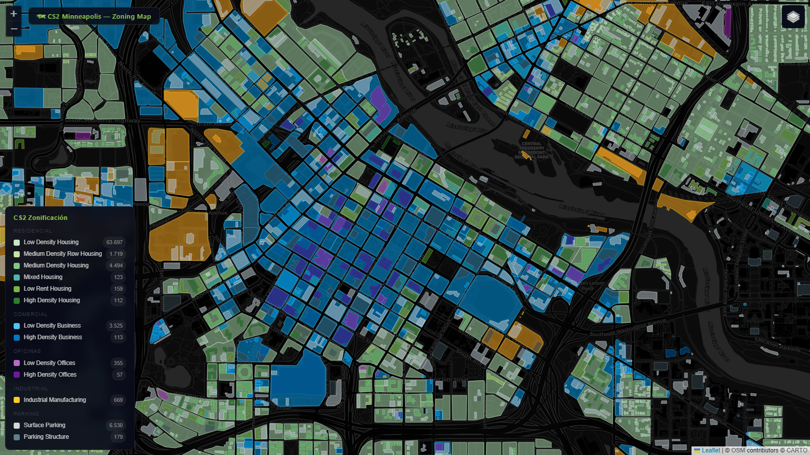
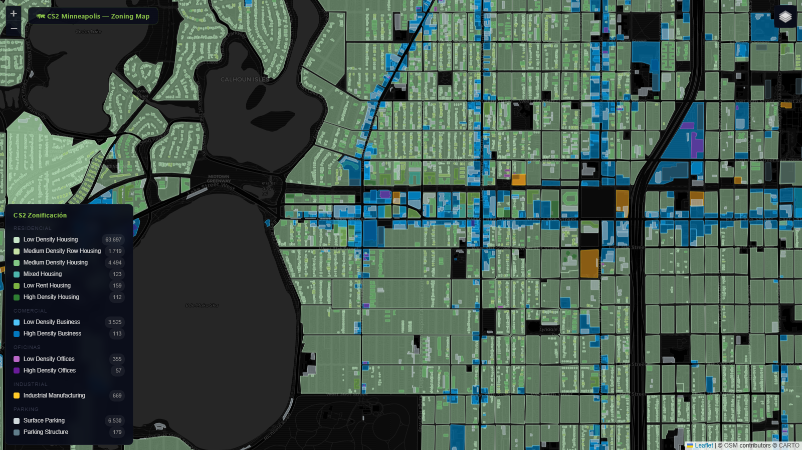

# CS2 Minneapolis Zoning — GIS Extraction Tool v3.0

> Real-world zoning data from OpenStreetMap → Cities: Skylines 2
> 100% open source · Zero API keys · Interactive dark map · 81,000+ polygons


## What This Does

Extracts real-world zoning polygons from OpenStreetMap via the Overpass API, classifies them into **all 11 official Cities: Skylines 2 zone types**, and renders them on an interactive dark-mode map you can use as a reference while building your CS2 city.

```
OpenStreetMap (Overpass API)
        ↓
  extract_zoning.py          ← 7 source queries, multi-endpoint retry, spatial joins
        ↓
  datos_zonificacion.js      ← Classified polygons by CS2 zone type
        ↓
  visualizer/index.html      ← Interactive Leaflet.js map (Canvas renderer for 80k+ polys)
```

No API keys. No paid services. No PostGIS. Just Python + a single HTML file.

## Preview


*Full Minneapolis at zoom 12 — block-level zoning visible across the whole city*



*Downtown at zoom 15 — high-density commercial (blue) + offices (purple) + Mississippi River*



*Uptown / Bde Maka Ska area at zoom 15 — residential grid with commercial corridors along Hennepin & Lyndale*

The default extract covers Minneapolis with **81,732 polygons** across 13 categories: 6 residential subtypes + 2 commercial + 2 office + 1 industrial + 2 parking.

## CS2 Zone Mapping

The classifier outputs the **exact** zone types that exist in Cities: Skylines 2:

### Residential (green family)

| CS2 Zone | OSM Rule | Map Color |
|---|---|---|
| Low Density Housing | `building` ∈ {house, detached, bungalow} or landuse fallback | `#A5D6A7` |
| Medium Density Row Housing | `building` ∈ {terrace, townhouse, row_house, semi, dormitory} | `#9CCC65` |
| Medium Density Housing | `building=apartments` with 2-4 effective floors | `#66BB6A` |
| **Mixed Housing** (apt + shop below) | Apartment building spatial-joined with shop/restaurant POIs | `#26A69A` (teal) |
| Low Rent Housing | `building=public_housing/council_house`, `social_housing=yes`, or 4-6 floors with footprint ≥1500 m² | `#558B2F` |
| High Density Housing | apartments with 7+ floors or `building` ∈ {tower, residential_tower, skyscraper} | `#1B5E20` |

### Commercial (blue family)

| CS2 Zone | OSM Rule | Color |
|---|---|---|
| Low Density Business | shops, restaurants, gas stations, cafés, marketplaces (default) | `#039BE5` |
| High Density Business | `shop=mall`, large hotels, cinemas/theatres/casinos, commercial with ≥4 floors | `#01579B` |

### Offices (purple family)

| CS2 Zone | OSM Rule | Color |
|---|---|---|
| Low Density Offices | `building=office` with 1-3 effective floors | `#9C27B0` |
| High Density Offices | `building=office` with ≥4 floors or skyscraper | `#4A148C` |

### Industrial (yellow)

| CS2 Zone | OSM Rule | Color |
|---|---|---|
| Industrial Manufacturing | `landuse=industrial` or `building` ∈ {industrial, warehouse, factory} | `#F9A825` |

### Parking (gray — reference only, not a CS2 zone)

| Category | OSM Rule | Color |
|---|---|---|
| Surface Parking | `amenity=parking` ground level | `#B0BEC5` |
| Parking Structure | `parking` ∈ {multi-storey, structure, underground} | `#37474F` |

## Quick Start

```bash
# 1. Clone
git clone https://github.com/Osyanne/cs2-minneapolis-zoning
cd cs2-minneapolis-zoning

# 2. Install uv (if not installed)
# macOS/Linux:  curl -LsSf https://astral.sh/uv/install.sh | sh
# Windows:      powershell -ExecutionPolicy ByPass -c "irm https://astral.sh/uv/install.ps1 | iex"

# 3. Install dependencies
cd src
uv sync

# 4. Extract data (~3-5 min, downloads from OpenStreetMap)
uv run extract_zoning.py

# 5. Open the visualizer (a local web server is needed for CORS)
cd ../visualizer
python -m http.server 8080
# → open http://localhost:8080 in your browser
```

**Windows users:** double-click `start-visualizer.bat` to launch the server + open the browser automatically.

## Adapt to Your City

1. Find your city's bounding box using [Nominatim](https://nominatim.openstreetmap.org/) or any GIS tool
2. Edit `MINNEAPOLIS_BBOX` in `src/cs2_zones.py`:
   ```python
   MINNEAPOLIS_BBOX = "44.86,-93.38,45.05,-93.17"  # change this to your bbox
   ```
3. Or pass it as an argument:
   ```bash
   uv run extract_zoning.py --bbox "40.70,-74.02,40.83,-73.91"  # New York example
   ```
4. Open `visualizer/index.html` — the map centers automatically on your bbox

See [docs/adapting-to-other-cities.md](docs/adapting-to-other-cities.md) for a detailed guide.

## Performance Highlights (v3.0)

| Feature | Impact |
|---|---|
| **Canvas renderer** (Leaflet `preferCanvas: true`) | Pan/zoom with 81k polygons: from laggy → smooth |
| **Tier-based hiding** (auto-hide individual houses at zoom <14) | First paint faster, less visual noise at city scale |
| **localStorage cache** (24h TTL) | Second load is instant |
| **Prebuilt data mode** (`datos_zonificacion.js`) | First load <1s vs 3-5 min Overpass live |
| **Spatial join Overpass query** | Mixed Housing detection improved from 3 → 123 polygons |
| **Multi-endpoint retry** (3 endpoints + 3 attempts × 2s/4s/8s backoff) | Resilient to Overpass overload |

## Project Evolution

Detailed plans for each milestone are in [docs/plans/](docs/plans/):

- **Session 1** (initial release) — density classification, basic visualizer
- **Session 1.5** — visualizer fixes (5 bugs closed) + CS Skylines palette + 32 tests
- **Session 1.6** — model realigned to CS2 oficial (13 zones), footprint heuristic, 4-family palette
- **Session 1.7** — Canvas renderer + tier-based hiding by polygon area
- **Session 1.8** (experimental, rolled back) — Microsoft Building Footprints augmentation. Script `src/extract_msbuildings.py` remains for future improvement. Known issue: current logic misclassifies suburban houses near commercial corridors. See plan notes if you want to fix.

## Methodology

All design decisions are documented in [METHODOLOGY.md](METHODOLOGY.md): why 7 source queries instead of 1, the dedup logic between OSM categories, the tier-based rendering, the spatial join for Mixed Housing, etc.

## Tools Used

- **Python 3.11** + **[uv](https://docs.astral.sh/uv/)** — package management & venv
- **[Overpass API](https://overpass-api.de/)** — OpenStreetMap data extraction (free, no key, multi-endpoint with retry)
- **[Leaflet.js](https://leafletjs.com/)** — interactive map rendering with Canvas backend
- **[CartoDB Dark Matter](https://carto.com/basemaps/)** — basemap (free tile service)
- **[Shapely](https://shapely.readthedocs.io/)** (optional, for `extract_msbuildings.py`) — spatial joins

## Optional: bbox-mcp-server

If you use AI assistants (Claude, Copilot, etc.) in your workflow, [bbox-mcp-server](docs/bbox-mcp-server.md) is a community MCP server that lets your AI query bounding boxes directly from OpenStreetMap.

## Data Coverage

| | |
|---|---|
| **Bounding box** | `44.86,-93.38,45.05,-93.17` (Minneapolis + immediate borders) |
| **Total polygons** | 81,732 |
| **Tests** | 61 passing (50 classifier + 11 query sanity) |
| **Last extracted** | 2026-05-14 |

## License

MIT — see [LICENSE](LICENSE)
Map data © OpenStreetMap contributors, available under the [Open Database License (ODbL)](https://www.openstreetmap.org/copyright)
